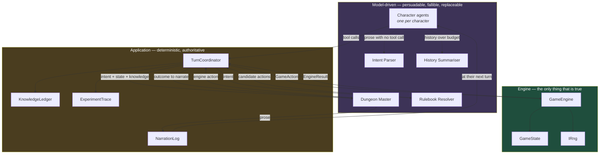
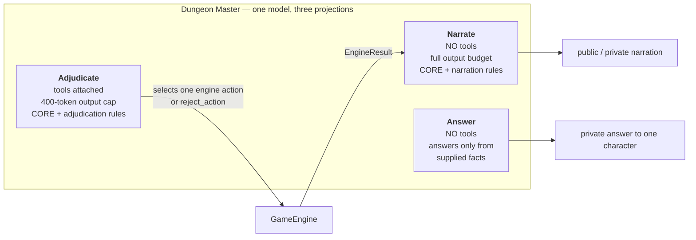
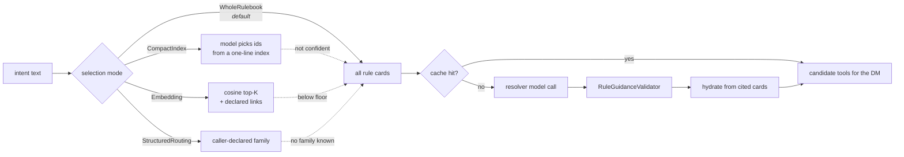
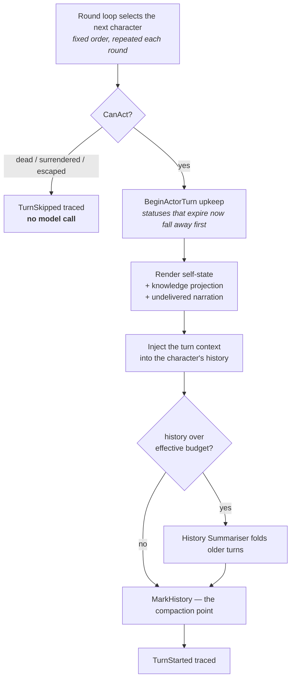
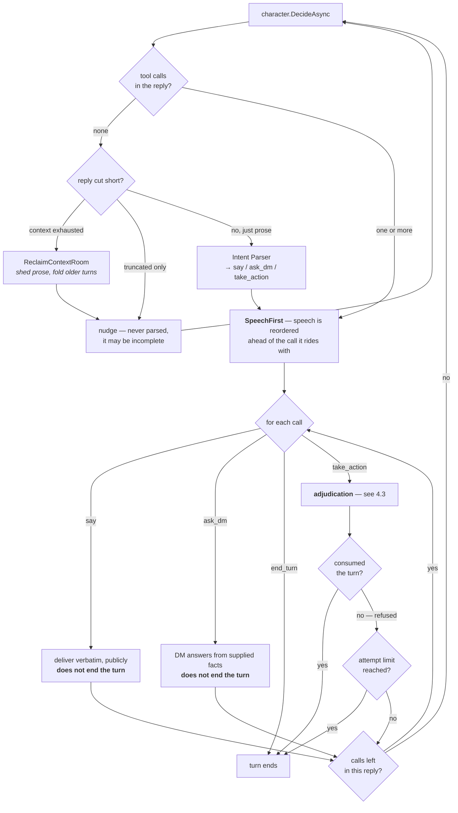
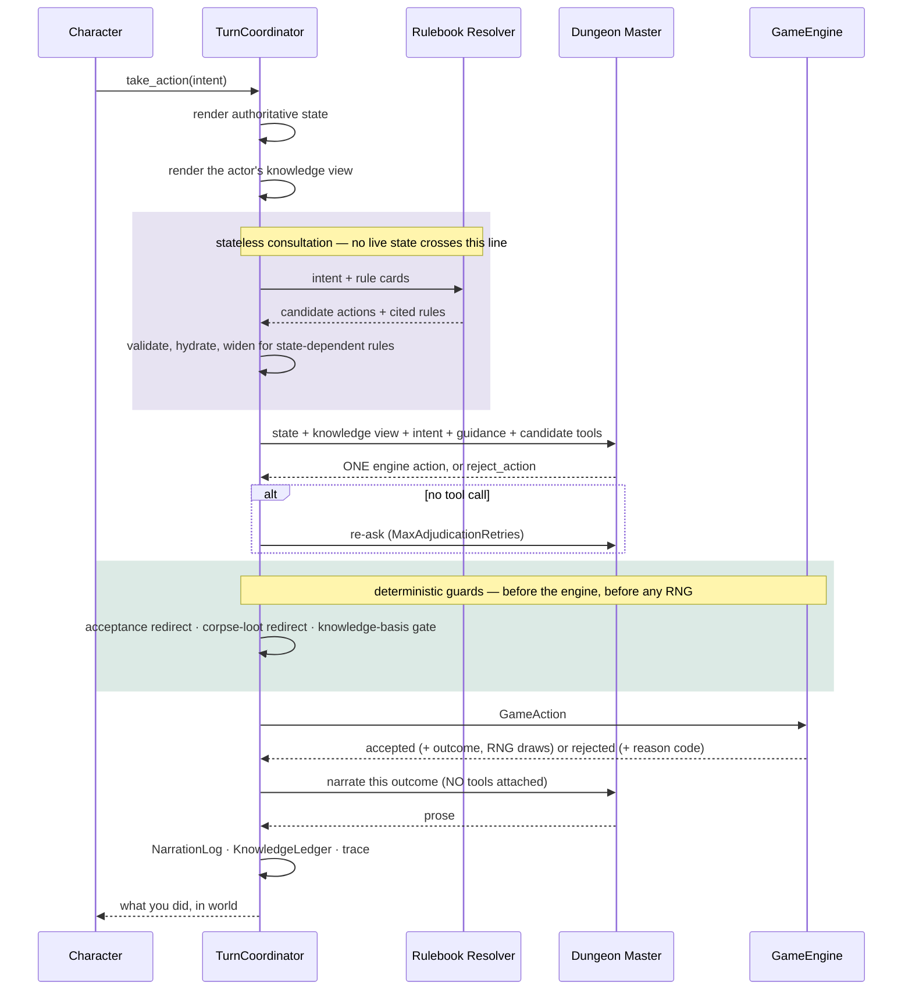
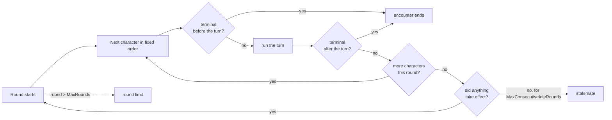
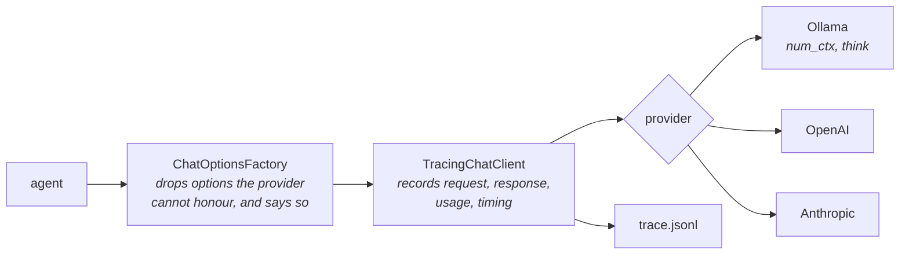
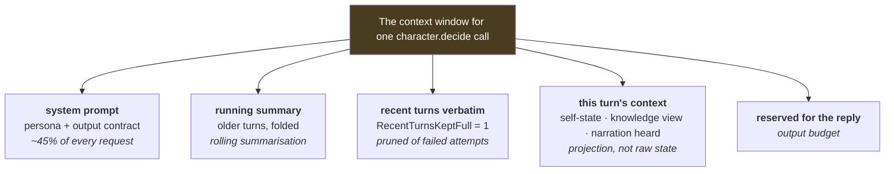

# Architecture

How Models & Monsters is put together: the components, the agents and what each is for, exactly what a
character's turn passes through, and every configuration lever there is.

This is the structural companion to `README.md`. The README explains *why* things are the way they are —
which live run broke, what was measured, what was tried and dropped. This document explains *what* they are.
Where a design choice has a hard-won reason behind it, this file states the choice and points at the README
section that carries the evidence.

§8 is a glossary in the other direction: the AI techniques this project uses, named, with a pointer to where
each one lives.

---

## 1. The shape of the thing

Models & Monsters is a **harness for observing how language models behave when they are not allowed to
decide what is true**. Several model-driven agents play out a tabletop encounter, but none of them can
change the world. All mutation goes through a deterministic C# engine.



Three rules follow from that split, and most of the design is downstream of them:

1. **A model proposes; the engine disposes.** No model writes to `GameState`. The Dungeon Master's most
   powerful act is to *select an engine action*; the engine then decides whether it happens.
2. **Narration is toolless.** The DM's narration and answering calls are made with no tools attached, so it
   is structurally impossible for the DM to change the world while describing it.
3. **Nothing infers game meaning from language.** No regexes, keyword lists or verb matching decide what a
   character meant. Meaning arrives as structured model output or not at all. (README: *Structure instead of
   pattern-matching*.)

---

## 2. The agents

Five distinct model-driven roles. They differ in what they can see, which is the point — most of the
interesting behaviour comes from what an agent is *denied*.

| Agent | Count | Stateful? | Sees live state? | Sees history? | Holds tools? |
| --- | --- | --- | --- | --- | --- |
| **Character** | one per character | yes — own conversation | only its own self-state | yes, its own | `ask_dm`, `take_action`, `say`, `end_turn` |
| **Dungeon Master** | one | per-task projections | **yes** — the authoritative snapshot | only within a projection | engine actions, on adjudication only |
| **Rulebook Resolver** | one | **no** — stateless per call | **never** | never | none (returns JSON) |
| **Intent Parser** | one | **no** — stateless per call | never | never | the character tool set (`CharacterTools.All`) |
| **History Summariser** | one | **no** — stateless per call | never | the slice being folded | none |

### 2.1 Character agents (`CharacterAgent`)

One per character in the scenario, each with its own conversation, its own model profile and its own
persona (backstory, personality, wants, needs, fears, goal). A character is the only agent that gets to
*want* something.

A character sees: its own self-state block, a bounded projection of what it has personally discovered, and
the narration addressed to it since its last turn. It never sees another character's sheet, another's fear
figure, or anything hidden it has not learned.

It has exactly four tools, and **its entire reply is expected to be a tool call** — a firm output contract
that measurably stopped prose-mode collapse on small models (README: *Firm output contract*):

- `ask_dm` — a private question, answered from facts, bounded per turn
- `take_action` — a free-text *intent*; this is the only route to the world
- `say` — public speech, delivered verbatim, does **not** consume the turn
- `end_turn` — deliberately do nothing

### 2.2 The Dungeon Master (`DungeonMasterAgent`)

One agent with three jobs, and the separation between them matters more than it looks:



**Why projections.** With `ProjectDungeonMasterContext` on (the default), each job runs on a fresh context
carrying the shared CORE prompt, a current state snapshot and only that job's rules — not one ever-growing
conversation. This was measured, not assumed: with narration history attached, one traced adjudication was
misclassified **every time**; on a clean context it was correct **every time** (README: *DM context
projections*). Setting it false runs the old single-conversation behaviour for A/B comparison.

**Adjudication has its own small output cap** (`AdjudicationOutputTokens`, 400) — but **only where the
context window is shared between input and output**, i.e. on Ollama, where every token reserved for the reply
is a token taken from the request. On a hosted provider, output is budgeted separately from a far larger
input window, so the cap buys nothing and is not applied; the agent's configured `MaxOutputTokens` stands.
`AdjudicationOutputBudget` decides this from `BindingContextWindow` — the same signal the history budget uses
(§6.3).

Where the cap does apply it *can* be hit, by a model that deliberates in prose instead of calling a tool. The
harness converts the toolless truncated reply into a tool error and re-asks. Raising the cap there is the
wrong fix: a model thinking aloud fills whatever it is given, and the headroom comes out of the request.

### 2.3 The Rulebook Resolver (`RulebookResolver` + `RulebookConsultant`)

A **stateless, low-temperature** model call that reads the raw intent plus the rule cards and returns
structured guidance: which engine action(s) the intent could be, under which cited card(s), or that nothing
fits. It exists so the DM's system prompt does not have to grow a paragraph for every new action.

It **never sees live state, history, or hidden knowledge.** That is a deliberate constraint, and it has a
real cost the design accounts for: two rules — accepting a surrender, and looting a corpse — depend on the
state of the room, so the resolver cannot possibly route them. Those are redirected deterministically in
the coordinator instead (§4.4). README: *The stateless resolver cannot see state*.



The **validator** is the trust boundary. Guidance is untrusted advisory input, so it checks that cited
rules exist at the cited version, that they were actually *supplied for this request*, and that every
candidate action is governed by a surviving citation. Guidance claiming support with nothing left is
rejected as malformed.

**Hydration** matters for a non-obvious reason: the descriptive fields of the guidance are filled in from
the cited card by the application, not echoed back by the model. Before that, card length *was* the
resolver's output budget — lengthening one card truncated half the replies in a run (README /
`reports/rulebook-efficiency.md`).

Every alternative selection mode is required to **fall back to the whole bounded rulebook** whenever it is
not confident, so the worst case is the baseline's cost rather than an answer given without the rule that
mattered.

### 2.4 The Intent Parser (`IntentParser`)

A stateless, zero-temperature parser used when a character replies in prose with no tool call. It is handed
the same four tools the character has and reads the prose into the calls it implies — plural, so one reply
can yield a spoken line *and* an action, and the turn resolves in one pass. It always yields at least one
call.

**It is a convenience, and it degrades.** Everything it does was survivable before it existed, so when its
own model call cannot be completed the turn falls back to the nudge path rather than failing. It had no such
path once, and a provider-side 500 took a whole run down with it (§5).

It replaced a nudge loop that re-asked the character to reformat one call at a time, which grew the context
on every attempt and eventually saturated it. A **truncated** reply is never parsed — it may be incomplete —
only nudged.

### 2.5 The History Summariser (`HistorySummariser`)

A stateless, low-temperature agent that folds a character's older turns into a running recap, keeping the
most recent `RecentTurnsKeptFull` turns verbatim. It runs at **turn start**, after the turn's context has
been injected, because the budget's whole question is "does the request I am about to send fit" — and that
is only knowable once the context is in place (§4.1).

A blank recap leaves the history untouched: losing older turns for nothing is worse than carrying them.

---

## 3. Non-agent components

| Component | Role |
| --- | --- |
| `GameEngine` | The only writer of `GameState`. Validates every action, applies it atomically, draws all RNG, and returns an `EngineResult` (accepted with an outcome, or rejected with a reason code). |
| `GameState` | Immutable snapshot: characters, room, objects, exits, statuses, offers, version. Every mutation is a new state with a bumped version. |
| `TurnCoordinator` | The application's decision-making core. Runs a turn, routes tool calls, enforces harness limits, applies the deterministic guards, delivers narration and knowledge. |
| `KnowledgeLedger` | Who has observed what, separate from state. State is current mechanical truth; the ledger is the growing record of observation. Hearsay is never stored as knowledge. |
| `NarrationLog` | Holds narration until its recipients' next turn, so a character reads what happened to it at the moment it acts. |
| `RuleCatalog` | The rule cards, versioned by content hash, so a citation is checkable. |
| `ExperimentTrace` | Every event, in order, to `trace.jsonl`. The run's evidence. |
| `RunReportWriter` | Renders `run.json` + `trace.jsonl` + `final-state.json` into a readable report. Built purely from artefacts — it never re-runs anything. |
| `IRng` | Single source of randomness, seeded from the master seed, recording sequence position on every draw. |

---

## 4. A character's turn, end to end

This is the part worth reading closely. A turn is a loop, not a single exchange: a character may speak, ask
and act within one turn, and only an accepted action or `end_turn` closes it.

### 4.1 Turn start



Two orderings here are deliberate and were both bought with a broken run:

- **Upkeep before rendering.** A status whose rule fires now must be gone before the character is shown its
  own state, or it is told it still has a guard that has already fallen away.
- **Summarise at turn start, not turn end.** Summarising between turns measures the history alone; the next
  turn then appends ~1,700 tokens of fresh context on top of a history that was just declared to fit. A live
  run put 7,967 tokens into an 8,192 window exactly this way. The budget is now measured against the request
  that will actually be sent.

The **effective budget** is `min(HistoryTokenBudget, window − output reserve − measured overhead − margin)`,
where the window is the agent's `BindingContextWindow` — the configured one on Ollama, and **nothing** on a
hosted provider, which never receives it (§6.3).

### 4.2 The decision loop



**Speech goes first, whatever order the reply put it in.** A warning is only worth anything if it lands
before the blow it warns about — and since v0.8 it is mechanical, not cosmetic: intimidating and steadying
are *defined* as speech aimed at one person, so a `say` dispatched after the `take_action` it belongs with
would leave the engine seeing an action with nothing spoken.

**Once the turn is resolved, everything else in the reply is discarded** — it never reaches the world, the
transcript or the knowledge ledger. This is what stops a model attacking and then emitting an unprocessed
theft declaration as though it acted twice. The discarded call is still *answered*, because leaving a tool
call unanswered corrupts the conversation history.

### 4.3 Adjudication — what `take_action` actually passes through



The DM is given **only the candidate tools the validated guidance allows**, so it cannot reach for an action
the rulebook did not licence. `reject_action` is always available — refusing is a first-class outcome.

### 4.4 The deterministic guards

Three things are decided in code rather than by any model, because each depends on state the deciding
component cannot see:

| Guard | What it does | Why it exists |
| --- | --- | --- |
| **Acceptance redirect** | A reach for what a pending offer promises, by that offer's named recipient, becomes `accept_surrender` rather than a theft. | The resolver never sees offers. In a live v0.7 run, three offers were made and `accept_surrender` was never once among the DM's candidate tools — each grab of the promised tribute destroyed the offer it was accepting. |
| **Corpse-loot redirect** | Taking from a dead character becomes `take_item` from their corpse container, not `steal_item`. | The resolver cannot know the target is dead. A goblin once burned a whole turn on three rewordings of "loot the gold from dead Rowan". |
| **Knowledge-basis gate** | A theft or take is refused unless the actor has a legitimate reason to know the item is there. | A weak DM that leaks hidden state must not be able to turn that leak into a valid mutation. The prompt guides; this guarantees. |

### 4.5 Turn end

End-of-turn upkeep runs (statuses expire; an offer this character was the named recipient of and did not
take up lapses — both engine decisions, not narration's). Then `CompactTurnHistory` sheds the failed prose
replies and nudges the turn accumulated, keeping the clean tool calls and their results. **The full
exchange, including every discarded attempt, stays in the trace.**

### 4.6 The round loop



The terminal condition is checked **after every turn**, so the encounter stops the instant a team is
eliminated rather than finishing the round. A team is finished when it has no *active* combatants — the
surrendered and the escaped are alive and out, which is why six of ten v0.7 runs ended with nobody dead.

---

## 5. Everything a model call passes through

Every model call, from any agent, goes through `TracingChatClient` and `ChatOptionsFactory`:



`ProviderCapabilities` is the single table of what each provider supports — context window, seed, forced
tool choice, temperature+top_p together, whether it silently truncates history. Options a provider cannot
honour are **dropped and reported**, never silently ignored.

**Transient retry.** A provider can 5xx for a passing reason — most often its own tool-call parser rejecting
a reply the model malformed ([ollama#14834](https://github.com/ollama/ollama/issues/14834)). `ModelAgent`
retries up to three times, and each retry **re-samples**: the temperature floor escalates (0.4, then 0.8)
and the seed is offset by the attempt number.

The escalation is not cosmetic. A flat 0.1 floor is near-greedy, and a temperature-0 agent re-sent at 0.1
reproduces the same malformed reply — measured, in a run that died at round 5 while a 0.8-temperature agent
in the same trace recovered on its third attempt. The first attempt always uses the agent's exact profile,
so a run with no failures still replays identically; every attempt is traced with its `Attempt` number and
its resolved options.

A 4xx is never retried — that is a request we shaped wrong, and hammering it would not help.

---

## 6. Configuration

Everything lives in `src/ModelsAndMonsters/appsettings.json` (shared by the console app and the web UI),
with the scenario in `scenario.json`. Four sections: `Providers`, `Agents`, `Harness`, `Combat`.

### 6.1 `Providers`

| Key | Default | Notes |
| --- | --- | --- |
| `Ollama:Endpoint` | `http://localhost:11434` | |
| `OpenAI:ApiKeyEnvironmentVariable` | `OPENAI_API_KEY` | |
| `OpenAI:ApiKey` | – | Prefer user secrets or the environment variable. |
| `OpenAI:Endpoint` | – | Set to an OpenAI-compatible base URL — including Ollama's own `/v1`, which is how a local model gets forced tool choice. |
| `Anthropic:ApiKeyEnvironmentVariable` | `ANTHROPIC_API_KEY` | |
| `Anthropic:ApiKey`, `Anthropic:Endpoint` | – | As above. |

### 6.2 `Agents` — per-agent model profiles

Resolution order: an agent's own entry overlays `Agents:Default`, field by field. The resolved profile is
what the calls actually used, and it is what `run.json` records.

- `Agents:Default` — the base every agent inherits
- `Agents:DungeonMaster`
- `Agents:RulebookResolver`
- `Agents:Characters:<characterId>` — per character, by scenario id
- `Agents:Hero`, `Agents:Monster` — role-level defaults (v0.1 compatibility; the multi-actor runner resolves
  characters by id over `Default` and does not read these)

The **Intent Parser** and **History Summariser** are not configured separately: they derive from the DM's
profile with fixed overrides (temperature 0 and 0.3 respectively, reasoning off, small output budgets, and
their own derived seeds).

Every profile takes:

| Key | Notes |
| --- | --- |
| `Provider` | `Ollama` \| `OpenAI` \| `Anthropic` |
| `ModelId` | |
| `Temperature`, `TopP`, `TopK` | Dropped per provider where unsupported. Anthropic rejects temperature and top_p together — the harness keeps temperature. |
| `MaxOutputTokens` | Note the DM's adjudication uses its own 400-token cap regardless. |
| `ContextWindow` | **Only Ollama receives this** (as `num_ctx`). See §6.3. |
| `Effort` | `none` \| `low` \| `medium` \| `high` \| `max`. The cross-provider reasoning knob. **`none` is recommended here** — reasoning models otherwise burn the whole output budget thinking and narrate nothing. |
| `Thinking` | Legacy on/off, Ollama only. Superseded by `Effort`. |
| `Endpoint` | Per-agent override, e.g. a second Ollama host. |
| `ForceToolChoice` | Honoured by OpenAI/Anthropic; **silently ignored by Ollama's native `/api/chat`** (measured), so reported unsupported there. |
| `OmitSampling` | Drop temperature/top-p/top-k entirely. Some models forbid all three. Left null, the harness decides per model. |

**Seeds are not configured per agent.** Each is derived from `Harness:Seed`, so one master seed replays the
whole run — dice and every agent's sampling.

### 6.3 The context-window rule

`ContextWindow` is a **local-model setting**. Ollama takes it per request; OpenAI and Anthropic fix their
window per model and never see it. So a `ContextWindow` inherited from `Agents:Default` is real on a local
run and a fiction on a hosted one.

`AgentModelProfile.BindingContextWindow` is what actually bounds a request — the configured value where the
provider takes it, `null` otherwise — and it is what history budgeting, length-finish diagnosis and the
rulebook startup guard all read. A run announces which regime it is in at startup, and records
`BindingContextWindow` per agent in `run.json`.

Left unmanaged this was costing real fidelity: a gpt-5.4 run with every agent on the Ollama-tuned 8192 ran
**eleven history summarisations in six rounds**, replacing what characters said and did with recaps, to fit
a ceiling the provider would never have enforced.

`Harness:EnforceContextWindowOnHostedModels` (default `false`) holds hosted models to the configured window
anyway — **turn it on to level the field** for a like-for-like provider comparison, since a model that never
has to forget anything is not answering the same question as one working inside 8k.

### 6.4 `Harness`

The **Shipped** column is what `appsettings.json` actually sets, which is what a run uses unless you change
it. Where the C# default differs it is noted — that difference matters when a test or a tool builds
`HarnessOptions` directly rather than loading the file. Rows marked † are not in `appsettings.json` at all,
so the C# default is the shipped value.

**Determinism and scale**

| Key | Shipped | What it does |
| --- | --- | --- |
| `Seed` | `null` | Master run seed. Set → fully deterministic. Blank → a random master is generated, printed and recorded, so even a random run replays. |
| `MaxRounds` | 12 | Round ceiling. *(C# default 8.)* |
| `MaxConsecutiveIdleRounds` | 3 | Rounds with nothing taking effect before a stalemate is declared. *(C# default 2.)* |
| `RunOutputDirectory` | `runs` | |
| `EnforceContextWindowOnHostedModels` | `false` | §6.3. |

**Per-turn limits**

| Key | Shipped | What it does |
| --- | --- | --- |
| `MaxModelCallsPerTurn` | 10 | Hard ceiling on one character's model calls in a turn. |
| `MaxQuestionsPerTurn` | 2 | `ask_dm` budget. *(C# default 3.)* |
| `MaxActionAttemptsPerTurn` | 3 | Failed `take_action` attempts before the turn is abandoned. |
| `MaxSpeechActsPerTurn` | 2 | Speaking does not consume the turn, so this is the only bound on how much a character says before it must act. Two since v0.8: speech spent on an action the DM then refuses would otherwise leave a character with nothing to say on the retry. Exceeding it traces `SpeechNotHeard` — a rule of the world, deliberately **not** a harness limit. |
| `MaxSpeechCharacters` † | 600 | One runaway reply cannot flood every other character's context. |
| `MaxAdjudicationRetries` | 1 | Extra attempts when the DM answers without calling a tool. |

**Model-behaviour compensation**

| Key | Shipped | What it does |
| --- | --- | --- |
| `ProjectDungeonMasterContext` | `true` | Per-task DM projections. False runs the single-conversation mode for comparison. |
| `UseIntentParser` † | `true` | Parse a prose reply into the calls it implies. |
| `RecoverTextToolCalls` | `true` | Older, narrower salvage of a single tool call written as prose. The parser handles non-truncated replies first, so this is the remaining net. *(C# default false — off unless the config turns it on, so raw tool-calling behaviour stays observable by default.)* |
| `SummariseHistory` † | `true` | Fold older turns into a running recap. |
| `HistoryTokenBudget` † | 9000 | An **upper bound**, not the working figure — the derived window figure usually binds. Deliberately set above what an 8k window holds. |
| `RecentTurnsKeptFull` † | 1 | Turns kept verbatim. One, not two: each carries a full turn context, and keeping two re-sent two superseded copies of it every call. |

**Rulebook stage**

| Key | Shipped | What it does |
| --- | --- | --- |
| `EnableRulebookResolver` | `true` | False gives the DM the full engine tool surface directly (the v0.5 path). |
| `RulebookMaxCards` | 32 | A hard **ceiling**, not a trimming budget — exceeding it fails at startup rather than silently dropping the card an intent needed. |
| `RulebookMaxInputChars` | 32000 | Same discipline, in characters. |
| `RulebookOutputTokens` | 300 | The resolver's output limit and the room reserved for it in the startup fit check. |
| `RulebookCacheEnabled` | `true` | Reuse abstract guidance across identical consultations. |
| `RulebookSelectionMode` | `WholeRulebook` | `CompactIndex` / `Embedding` / `StructuredRouting` are **experimental**. Each must fall back to the whole rulebook when not confident. |
| `RulebookSelectionTopK` | 3 | Cards an embedding selection takes before link expansion. |
| `RulebookEmbeddingModel` | `nomic-embed-text` | Only read when the mode is `Embedding`. Blank falls back to an offline trigram prototype — a **lexical**, not semantic, measure. *(C# default blank.)* |
| `RulebookSelectionCacheEnabled` | `true` | Cache the selection separately from the answer. |

### 6.5 `Combat`

| Key | Shipped | What it does |
| --- | --- | --- |
| `GlancingBlowChance` | 25 | Low band of the single quality draw — half post-armour damage. 0 removes the band. |
| `CriticalHitChance` | 25 | High band of the *same* draw — double damage. Never a second roll. |
| `BaseStealChance` | 40 | Flat base chance for `steal_item`. |
| `BaseIntimidationChance` | 35 | Base for `intimidate_character`, before state-derived modifiers. **Nothing about the words spoken ever reaches it.** |

With the defaults the bands are 1–25 glancing, 26–75 solid, 76–100 critical.

### 6.6 `scenario.json`

The encounter itself: room (description, features, containers with contents and optional exterior clues,
exits), and characters — `Id`, `Name`, `Role`, `Team`, `MaxHealth`, `Health`, `Armour`, `HitChance`,
`Fear`, `Weapon`, `Inventory`, `Injuries`, `Abilities`, `BackstoryKnowledge`, and a `Persona` block
(`Backstory`, `Personality`, `Wants`, `Needs`, `Fears`, `Goal`).

**The persona block is a bigger lever than it looks.** `open_exit` and `escape_encounter` fired zero times
in eight consecutive runs across every model — until one written condition was added to a goblin's
backstory, and it fired two runs later, exactly on cue. Read the personas before suspecting the engine.

---

## 7. Run artefacts and diagnostics

Each run writes to `runs/<timestamp>-<id>/`:

| File | Contents |
| --- | --- |
| `run.json` | The manifest: resolved profiles (including `BindingContextWindow` and dropped options), seeds, scenario hash. |
| `trace.jsonl` | Every event in order. The run's evidence. |
| `final-state.json` | The world when the run stopped, under a `State` wrapper. |
| `report.md` | The full rendered report, including the transcript. |
| `report-summary.md` | The same without the trace dump. |

CLI modes:

```bash
dotnet run --project src/ModelsAndMonsters -- --report runs/<run-directory>
```

```bash
dotnet run --project src/ModelsAndMonsters -- --rulebook-probe "I grab the captain's purse"
```

```bash
dotnet run --project src/ModelsAndMonsters -- --rulebook-eval
```

`--report` re-renders from artefacts alone. `--rulebook-probe` runs one intent through the **configured**
selection path and prints what it chose. `--rulebook-eval` scores selection strategies against the labelled
corpus.

---

## 8. The techniques, by name

A map from the vocabulary to the code, for anyone who knows one and wants the other. Some of these are
established terms with reasonably settled meanings; others are descriptive labels for something this project
does that has no agreed name. Both are marked, because a confident-sounding label for an unnamed thing is
its own kind of mistake.

### 8.1 How the model is asked — prompt engineering

**Prompt engineering** *(established)* is the narrow one: the wording, structure and instructions of the
prompt itself. Here it takes four specific forms.

| Technique | What it means | Where |
| --- | --- | --- |
| **Templated prompts** | Prompts are files with named slots, not string concatenation in code — and they are **content-versioned**, with the hashes recorded in `run.json`, so a run says which prompt text produced it. | `Prompts/Templates/*.md`, `PromptLibrary` |
| **Modular system prompts** | A shared CORE (identity, world, state format) plus a block per job, composed per call rather than one monolith. | `DungeonMasterAgent` |
| **Output contracts** | Stating the *shape* of a valid reply, not just the task: "your entire reply is the tool calls." Measured to matter — a firmer contract took prose-mode tool calls from 62 to 0 on qwen. | character + parser system prompts |
| **Persona conditioning** | Backstory, wants, needs, fears and goal per character. The strongest behavioural lever in the project: one written condition in a persona woke a mechanic that had fired zero times in eight runs. | `scenario.json` → `character.system.md` |

### 8.2 What the model is asked *with* — context engineering

**Context engineering** *(established, newer)* is the umbrella term for deciding what occupies the context
window at the moment of the call — retrieval, filtering, compaction, isolation. It is where most of the
work in this project actually is, and it decomposes into several distinct named techniques.



| Technique | Established? | What it means | Where |
| --- | --- | --- | --- |
| **Retrieval (RAG)** | established | Fetch the knowledge a call needs instead of baking it into the prompt. Here: rule cards for an intent. The shipped path sends the whole small rulebook; the experimental `Embedding` mode is textbook RAG — embed, cosine top-K, expand along declared links, fall back below a confidence floor. | `RuleRetriever`, `Selection/` |
| **Context isolation** | established | Give a task its own clean context rather than one growing conversation. The DM's per-job projections. Measured: with narration history attached an adjudication was misclassified every time; on a clean context, never. | `ProjectDungeonMasterContext` |
| **Context compaction** | established | Remove what is no longer load-bearing. Two distinct mechanisms here, often conflated: **pruning** (drop the turn's failed prose and nudges, and the reasoning a model wrote alongside its call — keeping only the call itself) and **rolling summarisation** (fold older turns into a recap via a dedicated model). | `CompactTurnHistory`, `HistorySummariser` |
| **Context budgeting** | descriptive | Compute how much history may be carried from the real arithmetic — window − output reserve − *measured* prompt overhead − margin — rather than a number someone typed. The overhead is learned from what the provider reports it processed. | `ContextTruncation.EffectiveHistoryBudget` |
| **Projection / view models** | descriptive | Never hand a model the raw state object. Each agent gets a rendered *view* built for it: the character's self-state, the DM's authoritative snapshot, the actor's knowledge view. | `WorldStateFormatter`, `CharacterKnowledgeView` |
| **Information asymmetry** | descriptive | Context scoped to what each agent legitimately knows, enforced by the application rather than requested in the prompt. A character cannot see another's sheet; the resolver cannot see state at all. | `KnowledgeLedger` |
| **Semantic caching** | established | Reuse a model's answer for an equivalent input. Keyed on `(intent, cards, model, schema version)`, so a rule change or a model swap invalidates it correctly. | `RuleGuidanceCache` |

### 8.3 How the model is allowed to act

| Technique | Established? | What it means | Where |
| --- | --- | --- | --- |
| **Tool calling** | established | Structured, schema-checked calls instead of free text. Both directions here: characters call four intent tools, the DM calls engine actions. | `CharacterTools`, `DungeonMasterTools` |
| **Structured output** | established | A schema the reply must satisfy, parsed and validated rather than read. The resolver returns `guidance-v2` JSON; speech acts like intimidation are structured fields, never inferred from wording. | `RuleGuidanceSchema` |
| **Dynamic tool narrowing** | established (a.k.a. tool masking / filtering) | Give the model only the tools that could be right for *this* call, decided upstream. The validated guidance narrows the DM's tool set per adjudication. | `RulebookConsultant` → `ProposeActionAsync` |
| **Semantic routing** | established | Use a small, cheap, stateless model call to classify an input and route it, rather than growing one prompt to cover everything. That is exactly what the Rulebook Resolver is. | `RulebookResolver` |
| **Mediated actuation** | descriptive | *The model proposes; the engine disposes.* No model writes state. The most powerful thing the DM can do is **select** an action; the engine then decides whether it happens. This is the load-bearing architectural choice of the whole project. | `GameEngine` |
| **Toolless-by-construction** | descriptive | Narration and answering calls are made with **no tools attached**, so it is structurally impossible — not merely forbidden — for the DM to change the world while describing it. | `DungeonMasterAgent` |
| **Deterministic policy override** | descriptive | Decisions that depend on state the deciding component cannot see are made in code, not by any model: the acceptance redirect, the corpse-loot redirect, the knowledge-basis gate (§4.4). | `TurnCoordinator` |
| **Grounded answering** | established | Answer only from explicitly supplied facts, never from the model's own knowledge or invention. | `AnswerFacts` |
| **Verifiable citation** | descriptive | Guidance must cite a rule **id at a content-hash version**, checked against the catalog and against the cards actually supplied — so a citation is falsifiable rather than decorative. | `RuleGuidanceValidator` |

### 8.4 How failure is handled

Most of this project's hard-won detail lives here rather than in the happy path.

| Technique | Established? | What it means | Where |
| --- | --- | --- | --- |
| **Output validation / guardrails** | established | Treat model output as untrusted input crossing a trust boundary: check shape, bounds, and that the parts correspond to each other before anything acts on it. | `RuleGuidanceValidator` |
| **Output repair** | descriptive | When a model breaks protocol, use a second, cheap, stateless model to read what it meant into the calls it implies — rather than arguing with the first one. | `IntentParser` |
| **Self-correction loop (nudging)** | established | Tell the model its reply was malformed and ask again. Kept as the fallback, not the primary: it grows the context on every attempt, which is how one run saturated its window. | `TryRecoverOrNudge` |
| **Re-sampling on retry** | descriptive | A retry after a provider failure must draw *differently*: escalate the temperature floor and move the seed. A retry that re-sends the same near-greedy draw is not a retry — measured, in a run that died at round 5 (§5). | `ModelAgent.WithRetrySampling` |
| **Fallback cascade** | established (graceful degradation) | Every optional component has a defined next-best behaviour: selection modes fall back to the whole rulebook, the parser falls back to nudging, a blank recap leaves history untouched. **An optional component must never be able to end a run.** | throughout |
| **Context reclamation** | descriptive | When a reply fails because the window was full, make room *before* re-asking. Appending a nudge to a request that had no room guarantees the retry fails identically — measured: three consecutive failed retries on one turn. | `ReclaimContextRoomAsync` |
| **Harness limits** | descriptive | Hard ceilings on model calls, questions, attempts and rounds, so a misbehaving model costs a bounded amount and the run still terminates. | `HarnessOptions` |

### 8.5 How it stays reproducible and legible

| Technique | Established? | What it means | Where |
| --- | --- | --- | --- |
| **Harness** | established | The scaffolding around the model that makes it usable and observable: orchestration, limits, tracing, artefacts. The word for this whole project, really. | `Orchestration/`, `Tracing/` |
| **Reproducible sampling** | descriptive | One master seed derives the game RNG and every agent's model seed, so a whole run replays from a single number — and a random run records the master it used. | `RunSeeds` |
| **Full-fidelity tracing** | established (observability) | Every request, reply, usage figure, RNG draw and harness decision recorded in order. The report is rendered **from artefacts alone** and never re-runs anything. | `ExperimentTrace`, `RunReportWriter` |
| **Capability negotiation** | descriptive | A single table of what each provider actually supports; unsupported options are **dropped and reported**, never silently ignored. | `ProviderCapabilities` |
| **A/B switches** | established | Superseded designs stay behind a flag so a claim can be re-measured rather than remembered: single-conversation DM, resolver off, parser off, selection modes. | `HarnessOptions` |

### 8.6 The pattern deliberately *not* used

**No language parsing for game semantics.** No regexes, keyword lists, verb lists or phrase matching decide
what a character meant, what was said, or what an action was. Meaning arrives as structured model output or
it does not arrive. Where a guarantee is needed beyond what a prompt can promise, it is enforced on
**structured state** — never by pattern-matching prose. The one deterministic text check that survives is a
narrow *detector* for machinery language leaking into narration, which triggers a re-ask; it decides nothing
about the world.

The reason is empirical, not aesthetic: every keyword approach tried in this project failed on the case it
was not written for — an escape intent that never says "escape", a theft that reads as an acceptance.

## 9. Project layout

```text
src/ModelsAndMonsters/
  AI/             provider abstraction, capabilities, context arithmetic
  Agents/         the five model-driven roles, their tools and conversations
  Configuration/  SimulationOptions, ScenarioDefinition
  Domain/         Character, GameState, items, statuses — immutable records
  Engine/         GameEngine, CombatRules, actions, outcomes, rejection reasons
  Knowledge/      the observation ledger
  Orchestration/  SimulationRunner (rounds), TurnCoordinator (turns)
  Presentation/   console output
  Prompts/        templates + WorldStateFormatter
  Randomness/     IRng and seed derivation
  Rulebook/       cards, catalog, resolver, validator, Selection/
  Tracing/        ExperimentTrace, artefacts, RunReportWriter
src/ModelsAndMonsters.Web/   web UI over the same core
tests/                       ~900 tests, no live models
docs/                        this file, the initial spec, per-version build notes
reports/                     measured findings per version
```
